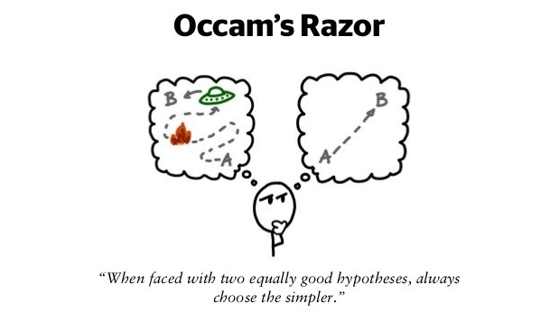
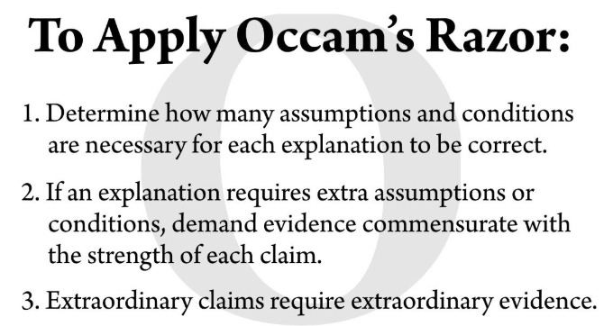

# Occam's Razor: A Guide

## 1. Definition & Explanation

Occam's razor as a principle of critical thinking and problem-solving has many varying explanations but the most comprehensive one is:

***The simplest explanation that covers all observations and evidence and has the fewest assumptions is the most preferred. When choosing between two competing explanations the one with the least assumptions is most likely the best.***

Therefore, it is usually best to make decisions on the simplest options with the fewest steps provided they cover all the evidence present.

In relationships, it is best to assume that the simplest explanation as to other people's behaviour instead of assumptions.

However, please note that while the simplest explanation is to be the most preferred it will not be the best if it doesn't support **all** of the present evidence and observations.

## 2. Example

Notice in the image below how the explanation on the left assumes so many factors where as the one on the right is much simpler with fewer assumptions yet both try to answer the same question of how the universe came into being.




## 3. How to Apply?



## 4. Applications

1. **User Interface (UI) Design**

    Occam's Razor guides designers to focus on core functionality and eliminate distractions.

    **Before:** Cluttered interfaces with too many options overwhelm users, hindering usability.

    **After:** Clean, minimalist designs prioritize essential elements, improving user experience and reducing cognitive load.

    &nbsp;
    &nbsp;

2. **Software Development**

    Applying Occam's Razor results in more robust and efficient software.

    **Before:** Complex code with excessive dependencies and convoluted logic is prone to bugs and difficult to maintain.

    **After:** Simple, elegant code with clear structure and minimal dependencies is easier to understand, debug, and modify.

3. **Machine Learning**

    Occam's Razor promotes model parsimony, improving generalization and reducing computational cost.

    **Before:** Overly complex models with numerous features can overfit the training data, leading to poor performance on new data.

    **After:** Simpler models with fewer features can achieve similar accuracy while being less prone to overfitting and easier to interpret.

4. **Network Architecture**

    Simplifying network design enhances reliability and lowers operational costs.

    **Before:** Intricate network topologies with multiple layers and routers can introduce latency and increase management overhead.

    **After:** Streamlined networks with fewer components achieve the same performance with improved efficiency and reduced complexity.

5. **Product Design**

    Occam's Razor encourages designers to prioritize essential functionality and avoid feature creep.

    **Before:** Feature-rich products with unnecessary functionalities can be costly to develop and confusing for users.

    **After:** Products focused on core features are more affordable, easier to use, and often more successful.

## 5. Conclusion

Occam's Razor is a useful principle that has helps to reinvent thinking by helping us make more easier, simpler, and efficient solutions to any problems that we may face. A good example of that is:

```python
def is_positive(number):
  return number > 0 # Simple approach (Occam's Razor)

def is_positive_complex(number):  # More complex approach (unnecessary)
  if number > 0:
    return True
  else:
    return False
```

## 6. References

1. [Example 1](https://dyingwords.net/using-occams-razor-without-cutting-your-own-throat/)
2. [Example 2](https://www.linkedin.com/pulse/occams-razor-simplest-path-effective-decision-making-colin-wc9le)
3. [Apply Occam's Razor](https://www.youtube.com/watch?v=AQNxNeQ9cxw)