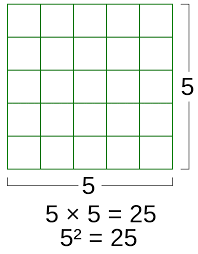
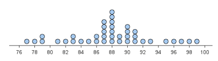
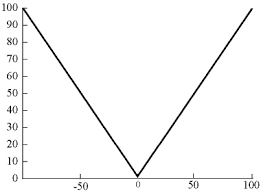
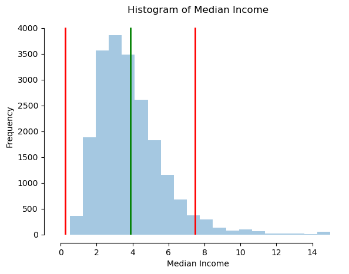
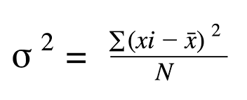
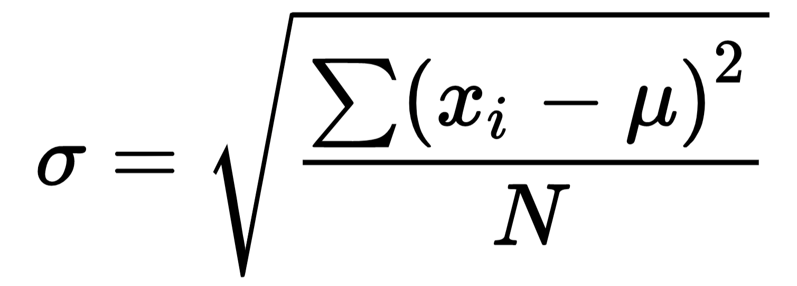

# Square on a number line

## Introduction

The square is an often seen measurement usually used in regards to the calculation of an area.

Over here the length of each side helps us to calculate the area of a square i.e. the area taken up by the square can be equally divided into N number of boxes where N is the product of the length of each side.

The sides having the same units of measurement cause the area to be the square of the units of measurement used.

So if both sides were in $cm$ the area is in $cm^2$.

This concept applies to 2D figures.

## Background

The problem arises when we apply our understanding of this concept to the numberline as it is only concerned with **1** axis AKA the **x-axis**.

In statistics, when we calculate the **Mean** AKA the **Average** of our values we often tend to look at the dispersion of the values that is on *average*, how far the rest of the values are from this point.

From the numberline above lets say our Mean is at 88.

To calculate the distance of each point from the Mean we use the formula:

***Distance of Point From Mean = Point - Mean***

## The Problem

The problem is for any value lesser than 88 our distance will be negative something that we know isn't true and that distance is **always** positive since it's a scalar quantity i.e. only has magnitude and no direction.

In this scenario if we try to take the absolute it will not work. If we are to make a graph of the values after taking absolute, it will look similar to:

The minimum point on this graph is **non-differentiable** due to infinite tangents at that point.

This therefore, is not the solution we need. Our second option is to take the **Square** of the values.

## The Solution

This right here is the climax of the problem. We saw [here](#introduction) that in a 2D grid, what we mean by the area and by extension the square(in some cases).

When we take the square for each of the values obtained from the formula we saw [here](#background). Although they are no longer negative they are a $unit^2$.

The **Mean** on the other hand is measured in the $unit$. Therefore, we simply cannot compare the 2 values and get our insights from them as they are2 **seperate** things.

Now, look at these 2 figures

> Make sure to focus on the red and green lines and see how far they are from each other.

Notice anything **different?**

In the 2nd figure notice how the red lines are almost **half** the distance away from the green line than they were in the 1st figure.

This is because the 1st figure represents how values on a number line behave if they are a $unit^2$ the reason the distance halves in the 2nd figure is because their distance from the green line is in $unit$ i.e. they stopped being multiplied by a factor equal to their magnitude themselves so they are now comparable.
This highlights the importance of the correct use of units and what they mean in the real of statistics and mathematics in general.

## What is the purpose of this entire document?

This entire document was written to help anyone in layman terms understand the difference between variance and standard deviation.

The formula of variance is:

Notice the square on the bracket? This entire document helped you understand the reason for that square and guided you through the formula derivation.

Notice how the variance symbol has a square on it (I'm referring to the symbol on the left hand btw)?

That is due to the fact that variance is a $unit^2$ in nature.

The formula for **standard deviation** is:

Notice how it's the same but now we take the **square root** of values.

Now, look at the 2 figures I provided [here](#the-solution) and voila you'll find your answer.

I hope this concept is now clear to you and has helped you understand the concept even more.

Happy Learning.

## Final Remarks and Resources

If you found this helpful please share it and like the post.

[My LinkedIn](https://www.linkedin.com/in/hassaanmustafa123/)

The resources I used for this were:

- [Learn Markdown](https://www.youtube.com/watch?v=qJqAXjz-Rh4)
- [Learn Probability with Python](https://www.youtube.com/playlist?list=PLnd7R4Mcw3rJDOxrwmwyK-EdJl8Tk431H)
- The pictures were searched on google.

The entire credit of this document goes to:

- My team leads at NetSol (Rohan and Fahid)
- Sir Nouman AKA Recluze
- Sir Aammar Tufail AKA Codanics
